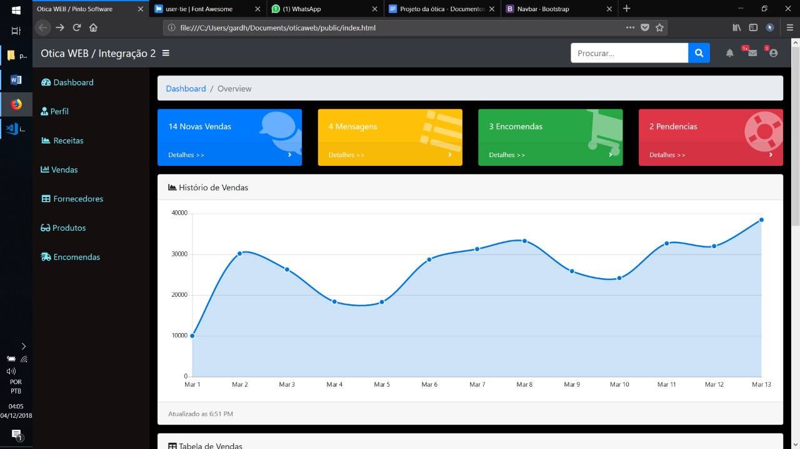

## About

Projeto para a disciplina Oficina de Integração 2 

## Description

O software de gerenciamento para óticas foca em ser um sistema que organize e auxilie óticas de pequeno porte a manter o seu controle sobre vendas (entrada, saída e caixa), encomendas de óculos para laboratórios, cadastrar dados pessoais e manter o histórico de cobrança e médico de clientes, dados de fornecedores, dados de funcionários e relatórios(produtos mais vendidos, vendas por funcionários), controle financeiro básico da empresa e emissão de carnê.
Sistema de gerenciamento de clientes - Este módulo somente pode ser operado por um usuário logado no sistema, a funcionalidade dele é permitir o cadastro, edição e remoção de dados de registro de clientes, checar débitos e gerar 2ª vias de carnês;
Sistemas de gerenciamento de entrada e saída - O usuário deverá cadastrar os produtos a venda do estabelecimento. No momento da vendo ele poderá selecionar um ou mais produtos cadastrados e o sistema deve apresentar a soma dos preços dos produtos;
Sistemas de encomenda de óculos - Aqui o usuário preenche com os dados do cliente a ficha médica para a encomenda. Que será armazenada e será ligada com o cadastro do cliente.

## Screenshots

